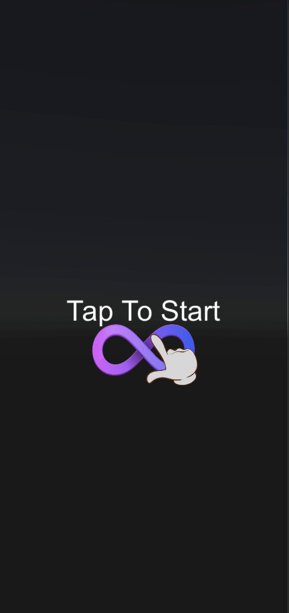

# Luna Essentials

We recommend that you read through our documentation covering Playable must-have Features and Localisation. 

This sample project, covers some of the must-have features for Playable that we reccomend to be included, along with two methods of localisation of which are outlined in the documentation. However, the localisation can be slightly modified to support both methods with either font upload with playground, or from inside Unity.

Documentation links:

https://docs.lunalabs.io/docs/playable/playable-ads/must-have-features

https://docs.lunalabs.io/docs/playable/playable-ads/playable-localisation

Specific font for different languages, can be found here: https://github.com/adobe-fonts/source-han-serif/tree/release/OTF
(fonts for Japanese, Chinese (Traditional and simplified), and Korean characters)

